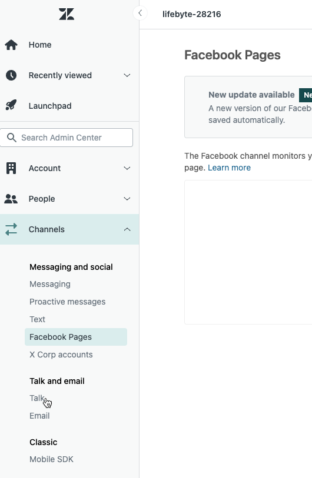
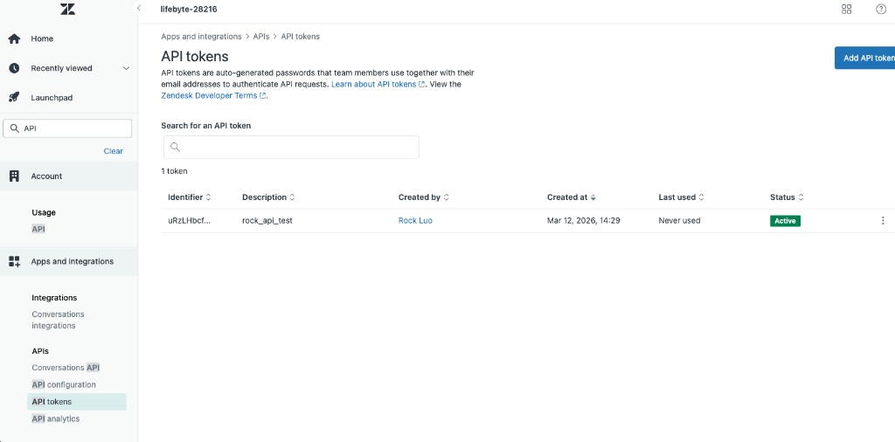

# Zendesk Help Center API — 集成方案

## 目录

- [方案概述](#方案概述)
- [前置条件](#前置条件)
- [第一部分：Zendesk 后台配置](#第一部分zendesk-后台配置)
- [第二部分：API 认证方式](#第二部分api-认证方式)
- [第三部分：核心 API 端点](./api-endpoints.md)
- [第四部分：技术实现 — 后端代理层](./backend-proxy.md)
- [第五部分：前端集成示例](./frontend-integration.md)
- [第六部分：踩坑记录](#第六部分踩坑记录)

---

## 方案概述

通过 Zendesk Help Center REST API，在业务系统内部构建自定义的知识库管理界面，实现：

- 分类（Categories）→ 章节（Sections）→ 文章（Articles）的层级浏览
- 全文搜索、文章 CRUD、附件管理、多语言翻译
- 完全嵌入业务系统，无需跳转到 Zendesk 页面

**与 JWT SSO 方案的对比**：

| 维度 | JWT SSO（新标签页/弹窗） | Help Center API |
|------|------------------------|-----------------|
| 用户体验 | 跳转到 Zendesk 页面 | 完全嵌入业务系统内 |
| 功能完整性 | Zendesk 原生完整功能 | 完整 CRUD + 搜索 + 附件 + 多语言 |
| 开发成本 | 低（只需 BridgePage） | 中（需要自建 UI） |
| Zendesk 计划要求 | Support 系列即可 | **Suite 系列**（需要 Guide 模块） |

---

## 前置条件

1. Zendesk 计划为 **Suite Team** 及以上（包含 Guide / Help Center 模块）
2. Help Center 已创建并激活
3. 拥有 Zendesk **Admin** 权限的账号
4. 已创建 API Token

> ⚠️ Support 系列计划不包含 Help Center，API 会返回 401。
>
> 

---

## 第一部分：Zendesk 后台配置

### 1.1 确认 Help Center 已激活

**路径**：Admin Center → Channels → Help Center

- 确认菜单中有 "Help Center" 选项（说明计划包含 Guide 模块）
- 确认 Help Center 状态为 **Active**

激活后访问地址：`https://{subdomain}.zendesk.com/hc/{locale}`

### 1.2 创建 API Token

**路径**：Admin Center → Apps and integrations → APIs → API tokens



1. 点击 **Add API token**
2. 填写 Description → **Save**
3. **立即复制 Token 值**（只显示一次）
4. 确认 Status 为 **Active**

**需要记录的信息**：

| 信息 | 说明 |
|------|------|
| API Email | 创建 Token 的管理员邮箱 |
| API Token | 创建时复制的完整 Token |
| Subdomain | Zendesk 子域名 |

---

## 第二部分：API 认证方式

Zendesk API 使用 **Basic Authentication**：

```
Authorization: Basic base64({email}/token:{api_token})
```

验证认证是否正确：

```bash
curl "https://{subdomain}.zendesk.com/api/v2/users/me.json" \
  -u "{email}/token:{api_token}"
```

返回真实用户信息说明认证正确；返回 `"Anonymous user"` 说明 Token 无效或未启用。

---

## 第三部分：核心 API 端点

> 📄 **[查看完整 API 端点文档](./api-endpoints.md)**
>
> 涵盖 Categories、Sections、Articles、Attachments、Search、Translations 的完整 CRUD 端点及权限说明。

---

## 第四部分：技术实现 — 后端代理层

> 📄 **[查看后端代理层文档](./backend-proxy.md)**
>
> 架构说明、代理层职责、路径映射规则及注意事项。

---

## 第五部分：前端集成示例

> 📄 **[查看前端集成文档](./frontend-integration.md)**
>
> 核心功能调用路径及关键说明。

---

