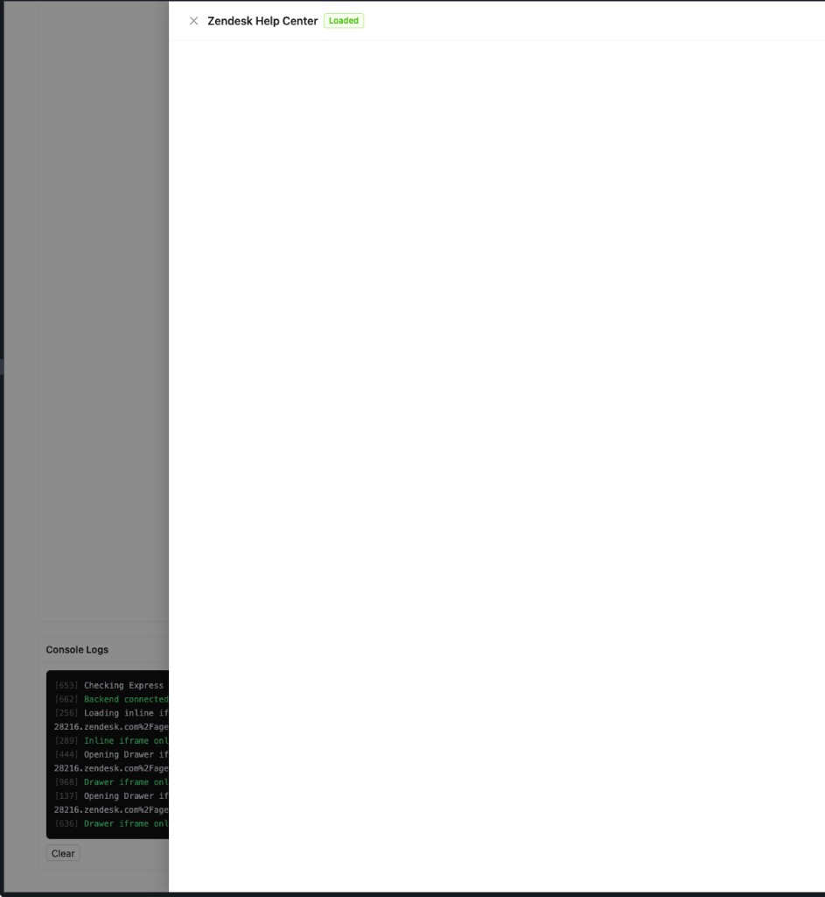
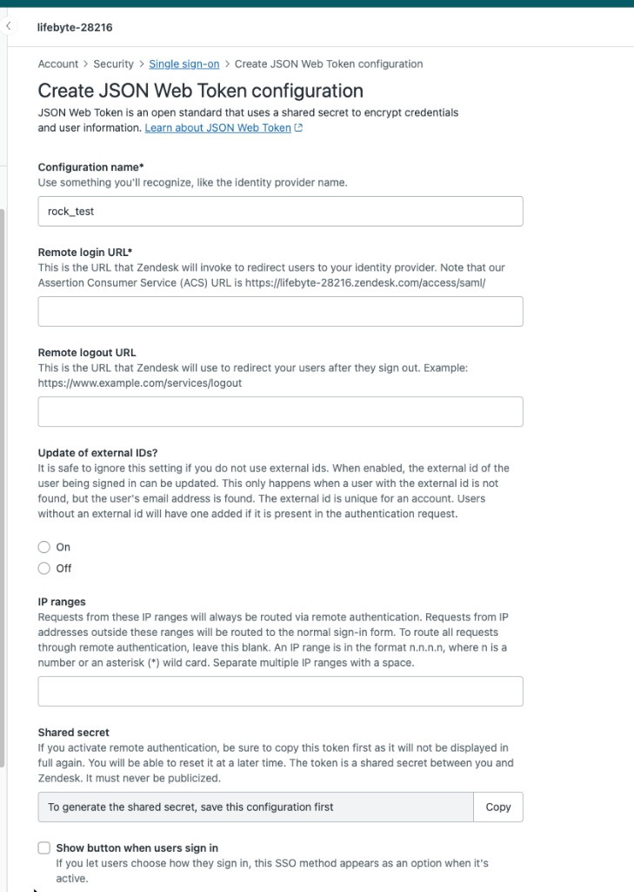
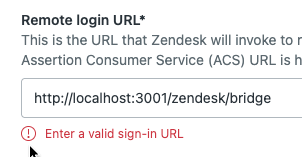
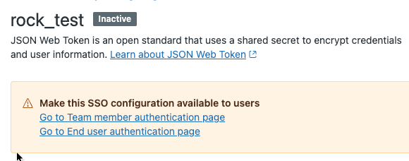
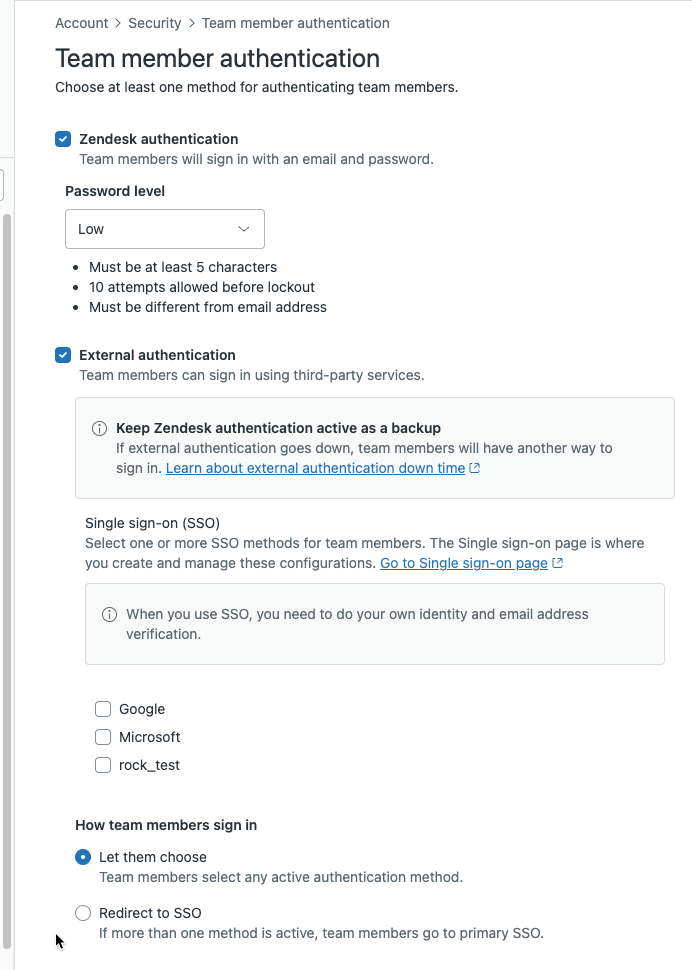

# Zendesk Help Center — JWT SSO 无感登录集成方案

## 目录

- [背景与目标](#背景与目标)
- [方案总览](#方案总览)
- [前置条件](#前置条件)
- [第一部分：Zendesk 后台配置](#第一部分zendesk-后台配置)
- [第二部分：技术实现 — BridgePage 服务](#第二部分技术实现--bridgepage-服务)
- [第三部分：前端集成](#第三部分前端集成)
- [第四部分：为什么不用 iframe](#第四部分为什么不用-iframe)
- [第五部分：生产环境注意事项](#第五部分生产环境注意事项)
- [附录：JWT Payload 字段说明](#附录jwt-payload-字段说明)

---

## 背景与目标

业务系统用户需要访问 Zendesk Help Center，目标是实现**无感登录（SSO）**：用户点击按钮，无需输入 Zendesk 账号密码，直接跳转到已登录状态的 Zendesk 页面。

Zendesk 官方支持的 SSO 方式为 **JSON Web Token (JWT)**，通过 BridgePage 中间页面完成认证跳转。

---

## 方案总览

| 方案 | 展示方式 | 可行性 |
|------|---------|--------|
| **A — 新标签页** | `window.open(url, '_blank')` | ✅ 已验证 |
| B — 内嵌 iframe | `<iframe>` 嵌入页面 | ❌ 被 Zendesk 安全策略阻止 |
| C — 侧边栏 iframe | Drawer + `<iframe>` | ❌ 同上 |
| **D — 弹窗窗口** | `window.open(url, name, features)` | ✅ 已验证 |

**结论：方案 A 和 D 可行，B 和 C 因 Zendesk 的 `X-Frame-Options: SAMEORIGIN` 被浏览器阻止。**



---

## 前置条件

1. 拥有 Zendesk **Admin** 权限的账号
2. Zendesk 计划需支持 JWT SSO（Team 及以上）
3. 后端服务能够识别当前登录用户的身份信息（email、name、external_id）

---

## 第一部分：Zendesk 后台配置

### 1.1 创建 JWT SSO 配置

**路径**：Admin Center → Account → Security → Single sign-on → Create SSO configuration → JSON Web Token



| 字段 | 说明 |
|------|------|
| Configuration name | 自定义名称，便于识别 |
| Remote login URL | BridgePage 的**公网 HTTPS 地址**（`http://localhost` 会被拒绝，见下图） |
| Remote logout URL | 用户从 Zendesk 登出后的跳转地址（可选） |
| Shared secret | 保存配置后生成，**只完整显示一次** |



> 开发阶段可先填占位 URL 以获取 Shared Secret，本地测试时前端直接调用 localhost 的 BridgePage。

### 1.2 激活 SSO 配置

保存后默认为 **Inactive**，需手动激活：



1. 在 SSO 配置详情页，点击 **"Go to Team member authentication page"**
2. 勾选 **External authentication** → 选中你创建的配置
3. 选择 **How team members sign in**（建议 "Let them choose" 保留密码登录备用）
4. **Save** 后状态变为 Active



---

## 第二部分：技术实现 — BridgePage 服务

### 架构

```
前端应用  ──window.open()──►  BridgePage（后端）
                                │
                           识别用户 → 签发 JWT → 返回自动提交表单
                                │
                           浏览器 POST jwt + return_to
                                │
                                ▼
                           Zendesk /access/jwt
                           验证 JWT → 建立 session → 302 重定向
```

### 核心流程

1. 用户点击按钮，`window.open()` 打开 BridgePage URL
2. BridgePage 识别当前登录用户（通过 session/cookie/token）
3. 使用 Shared Secret + HS256 签发 JWT（含 email、name、external_id）
4. 返回自动提交表单 HTML，POST 到 `https://{subdomain}.zendesk.com/access/jwt`
5. Zendesk 验证 JWT，建立 session，重定向到目标页面

### Express 实现

```javascript
import crypto from 'node:crypto';
import express from 'express';
import jwt from 'jsonwebtoken';

const app = express();

app.get('/zendesk/bridge', (req, res) => {
  const { target, email, name, external_id } = req.query;

  const payload = {
    iat: Math.floor(Date.now() / 1000),
    jti: crypto.randomUUID(),
    email: String(email),
    name: String(name),
    external_id: String(external_id),
  };

  const token = jwt.sign(payload, process.env.ZENDESK_SHARED_SECRET, { algorithm: 'HS256' });
  const action = `https://${process.env.ZENDESK_SUBDOMAIN}.zendesk.com/access/jwt`;

  res.type('html').send(`<!doctype html>
<html><body>
  <form id="zd" method="POST" action="${action}" style="display:none">
    <input type="hidden" name="jwt" value="${token}" />
    <input type="hidden" name="return_to" value="${String(target)}" />
  </form>
  <script>document.getElementById('zd').submit();</script>
</body></html>`);
});
```

**依赖**：`express`、`jsonwebtoken`

> 生产环境应从 session/auth 中获取用户信息，而非 query 参数。

---

## 第三部分：前端集成

前端构造 BridgePage URL，通过 `window.open()` 打开即可。

### 方案 A — 新标签页

```javascript
window.open(`${bridgeBaseUrl}?${params}`, '_blank', 'noopener,noreferrer');
```

适合长时间浏览文档、需要同时操作业务系统和 Zendesk 的场景。

### 方案 D — 弹窗窗口

```javascript
window.open(`${bridgeBaseUrl}?${params}`, 'zendesk_popup', 'width=1200,height=800,...');
```

窗口居中、尺寸可控，适合快速查看场景。弹窗被拦截时应降级为新标签页。

### 方案选择建议

| 场景 | 推荐方案 |
|------|---------|
| 长时间浏览文档 | A — 新标签页 |
| 快速查看/提交工单 | D — 弹窗窗口 |
| 移动端 | A — 新标签页 |

---

## 第四部分：为什么不用 iframe

- Zendesk 所有页面设置了 `X-Frame-Options: SAMEORIGIN`，只有 `*.zendesk.com` 域名可嵌入
- **Zendesk 不提供域名白名单功能**
- 即使能加载，还有第三方 Cookie 限制、Microsoft SSO 嵌套问题、CSP `frame-ancestors` 冲突等障碍

---

## 第五部分：生产环境注意事项

| 事项 | 说明 |
|------|------|
| Shared Secret | 存储在环境变量或密钥管理服务中，不能硬编码 |
| 用户身份 | BridgePage 必须从 session/JWT 获取用户信息，不能信任 URL 参数 |
| JWT 有效期 | Zendesk 允许 `iat` ±3 分钟偏差，无需额外设置 `exp` |
| jti 唯一性 | 每次使用 UUID，Zendesk 用它防止重放攻击 |
| Remote Login URL | 生产环境必须是公网 HTTPS 地址 |
| Host Mapping | JWT 提交必须 POST 到 `{subdomain}.zendesk.com/access/jwt`，不能用自定义域名 |

---

## 附录：JWT Payload 字段说明

| 字段 | 类型 | 必填 | 说明 |
|------|------|------|------|
| `iat` | number | ✅ | 签发时间（Unix 时间戳，秒），允许 ±3 分钟偏差 |
| `jti` | string | ✅ | 唯一标识符（UUID），防止重放攻击 |
| `email` | string | ✅ | 用户邮箱，Zendesk 用此匹配或创建用户 |
| `name` | string | ✅ | 用户显示名称 |
| `external_id` | string | 推荐 | 业务系统用户 ID，用于跨系统关联 |
| `organization` | string | 可选 | 用户所属组织名称 |
| `tags` | string | 可选 | 逗号分隔的标签列表 |
| `remote_photo_url` | string | 可选 | 用户头像 URL |
| `locale_id` | number | 可选 | 用户语言偏好 |
